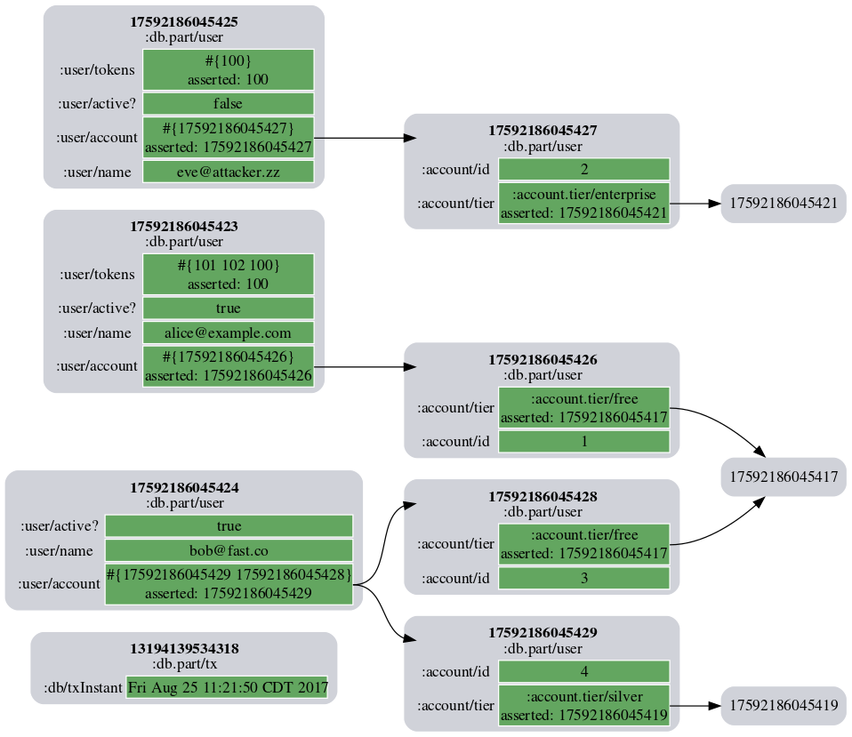
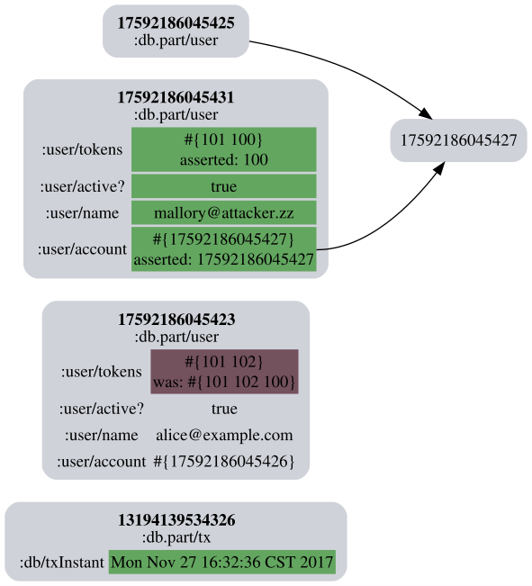

# datoms-say-what

Visualize entities and the effects of a transaction on them.

## Usage

Pass the results of a Datomic transaction to `datoms-say/what?`. It
will return a string containing SVG.

Here's an example from a comment block in `src/datoms_say.clj`:

```clojure
  (def users
    [{:user/name "alice@example.com" :user/tokens #{100 101 102} :user/active? true  :user/account #{"alice"}}
     {:user/name "bob@fast.co"       :user/tokens #{}            :user/active? true  :user/account #{"bob" "bob2"}}
     {:user/name "eve@attacker.zz"   :user/tokens #{100}         :user/active? false :user/account #{"eve"}}
     {:db/id "alice" :account/id 1 :account/tier :account.tier/free}
     {:db/id "eve"   :account/id 2 :account/tier :account.tier/enterprise}
     {:db/id "bob"   :account/id 3 :account/tier :account.tier/free}
     {:db/id "bob2"  :account/id 4 :account/tier :account.tier/silver}])

  (def result2 (d/transact conn users))

  (spit "doc/sample.svg" (datoms-say/what? @result2))
```

That produces this image:



(This is a PNG because GitHub won't render SVG in Markdown. XSS risk.)

This is what it looks like when there are retractions and changes in a
transaction:



## License

Copyright © 2017 Michael Nygard

Distributed under the Eclipse Public License either version 1.0 or (at
your option) any later version.
